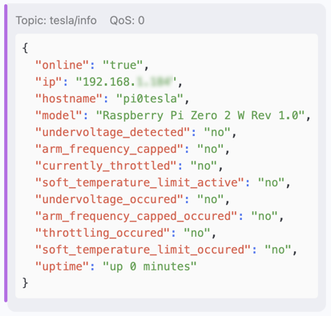
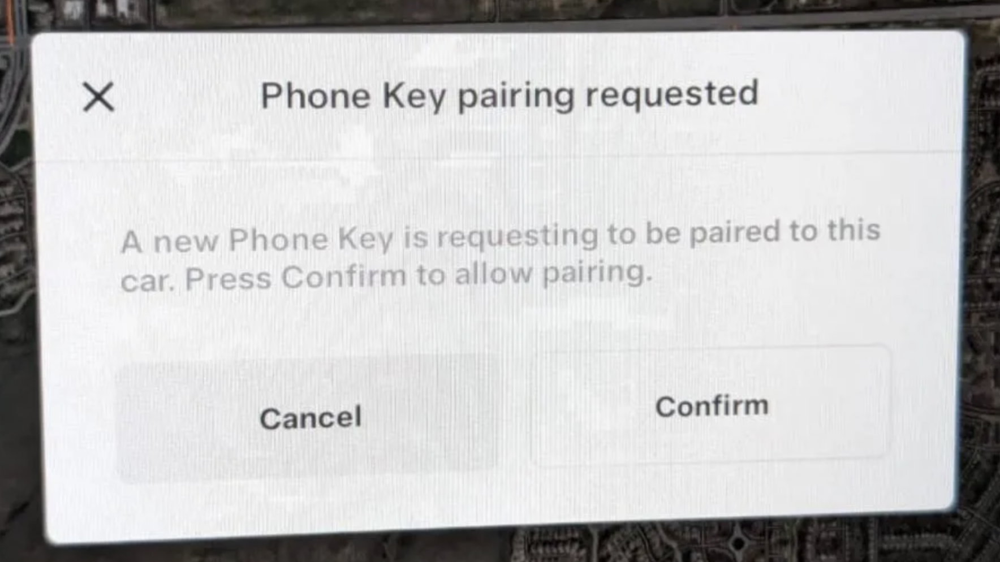

# Tesla BLE Command with Raspberry Pi Zero 2 W

After setting up your Raspberry Pi Zero 2 W with a fresh copy of Raspberry Pi OS Lite (64-bit) Debian Bookworm, the `setup.sh` script
will install all necessary tools to make your `Pi Zero 2 W` a fully functional Tesla Remote via Bluetooth Low Energy (BLE).

It uses the official `tesla-control` application from Tesla's GitHub page:  
https://github.com/teslamotors/vehicle-command/tree/main/cmd/tesla-control  
The source code will be compiled during installtion process.

*Why you ask?*  
I park my Tesla in an underground garage where I have WiFi installed. So accessing my Tesla via the Tesla App is no problem as long as the vehicle is awake.
If the vehicle is alseep, the  Tesla App tries to wake the car via cellular service. But as it is underground, I have no cellular service there. Hence the
App cannot wake the car anymore. This is where this project comes in handy. Via my Home Assistant setup I can now easily send the `wake` command to the
car via MQTT to the Pi Zero 2 W which is located near the vehicle in the garage (within BLE range) and connected to the WiFi network.
After sending the command, the vehicle is awake within seconds and I can use the Tesla App again.

But there is much more you can do than just "waking" the vehicle.

Features:
* Controllable via MQTT
* Add Pi Zero 2 W as Tesla Key
* Wake vehicle
* Lock vehicle
* Unlock vehicle
* Remote start vehicle
* Turn on climate control
* Turn off climate control
* Honk horn
* Flash lights
* Start charging
* Stop charging
* Open Cybertruck tonneau
* Close Cybertruck tonneau
* Stop moving Cybertruck tonneau
* Open vehicle trunk. Note that trunk-close only works on certain vehicle types
* Toggle trunk open/closed. Closing is only available on certain vehicle types
* Closes vehicle trunk. Only available on certain vehicle types
* Open vehicle frunk. Note that there's no frunk-close command
* Open charge port
* Close charge port
* Close falcon-wing doors and lock vehicle. Model X only
* Vent all windows
* Close all windows
* Fetch limited vehicle state information. Works over BLE when infotainment is asleep

After the successfull installation, the script will put your SD card partitions in read-only mode and activate an overlay filesystem.  
This means that there will be no write access to your SD card during normal operation which will not wear your SD card and should enable years of smooth operation.

## Installation

Just execute the following command on the freshly installed Raspberry Pi OS Lite:

```
bash <(curl -s https://raw.githubusercontent.com/gry79/rpi-zero-2w-tesla-ble/main/setup.sh)
```

When executing, it asks you for the IP address of your MQTT broker.

Installation takes a couple of minutes. It updates the system, installs GoLang for compiling the vehicle-command source code, compiles it and does some more stuff to have a smoothly running system at the end. Just look at the source code of `setup.sh`

## How it works

After the installation or after each start/restart of the Pi Zero, the system will send an INFO message to the topic `tesla/info`:



To send a command to the vehicle, use the topic `tesla/<TESLA_VIN>/command` and a single string with the command as payload:


The response is sent to topic `tesla/<TESLA_VIN>/response` with a JSON as response in payload:


## Pair vehicle

The first command you should send to your Tesla is the `add-key-request` command via the topic `tesla/<TESLA_VIN>/command`.  
In the background, the system creates a public/private key-pair to share with your vehicle.

After the command returns, put an activated KeyCard on the middle console of your car.  
The following message will appear, press "Confirm" to finish the pairing process:



That's it, you can now send all other commands to your Tesla. Try the `body-controller-state` command to test it.

I don't need to mention that the Raspi Zero always needs to be in BLE range to the vehicle, right?

## Configuration

Configuration file is placed in `/home/pi/bin/tesla/tesla-mqtt.properties`, there is only one config parameter

```
MQTT_BROKER=192.168.100.20
```

## Making changes to Configuration or Filesystem

**IMPORTANT:** The default is an overlay filesystem. It means that every change you make to files will only be stored in RAM and wil be lost after every reboot of the system!

To make changes, first enter this command in the Raspi terminal  
`sudo raspi-config nonint do_overlayfs 1`  
(yes, a 1 means DEACTIVATE, 0 means ACTIVATE)  
then reboot  
`sudo reboot`

After the reboot, the overlay filesystem is deactivated. You should then execute  
`sudo mount -o remount,rw /boot/firmware`  
to re-mount `/boot/firmware` in read/write mode and from now on, every change you make is persisted to the SD card.  
You can keep the system running in this mode but be aware that it will tear down your SD card much faster and it will die some day.

So it is recommended to do your changes, save them and then re-activate overlay filesystem  
`sudo raspi-config nonint do_overlayfs 0`  
and reboot again  
`sudo reboot`
